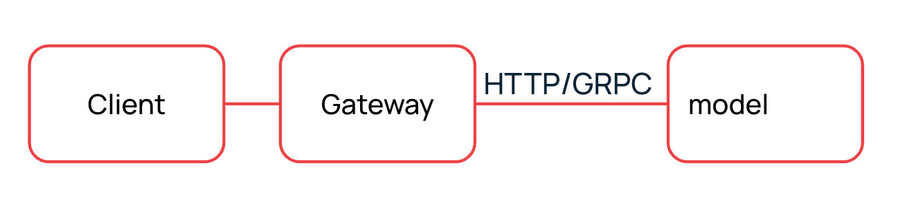
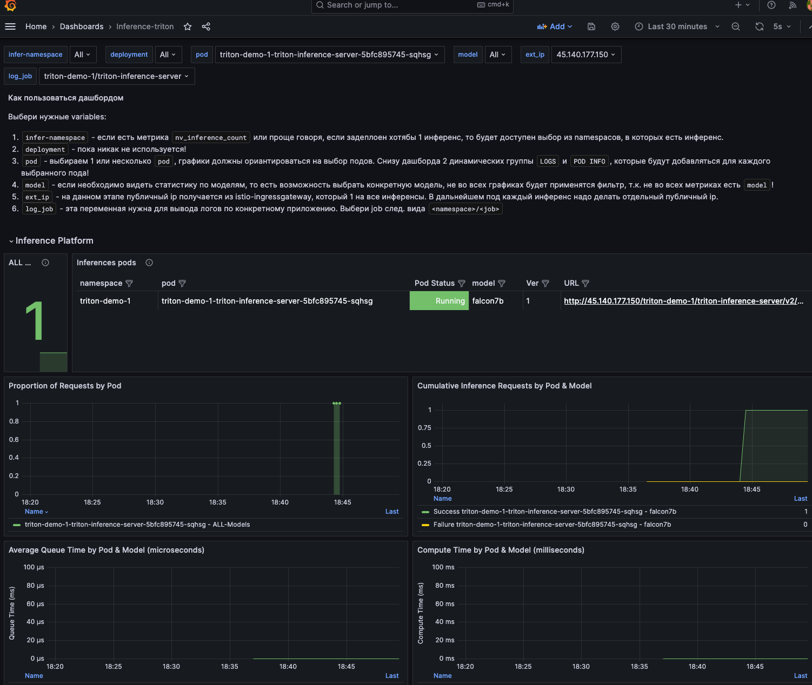
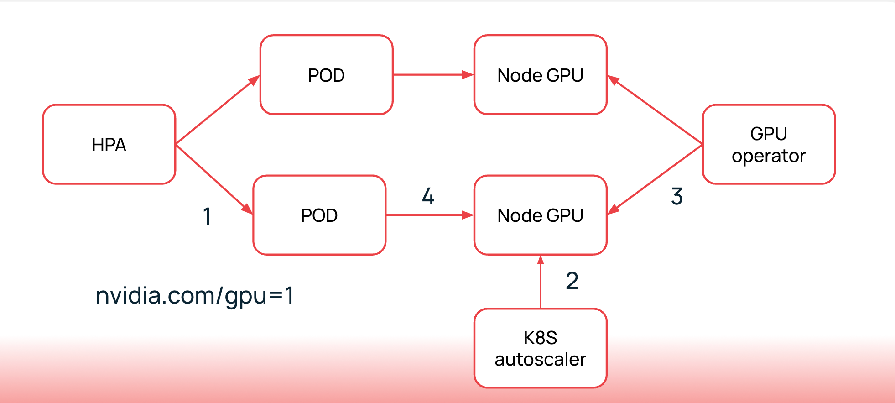
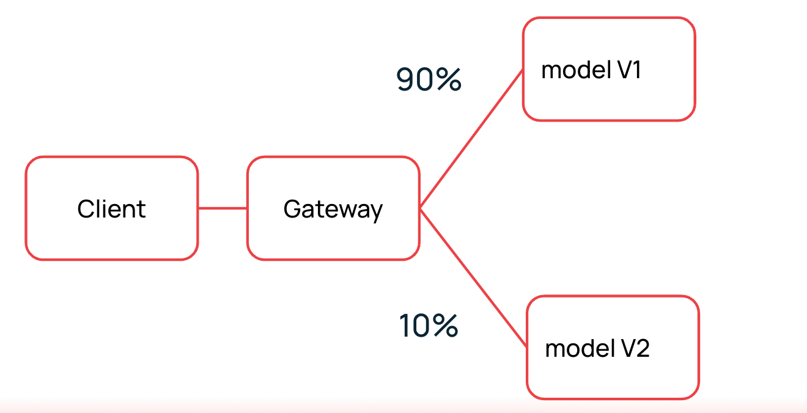
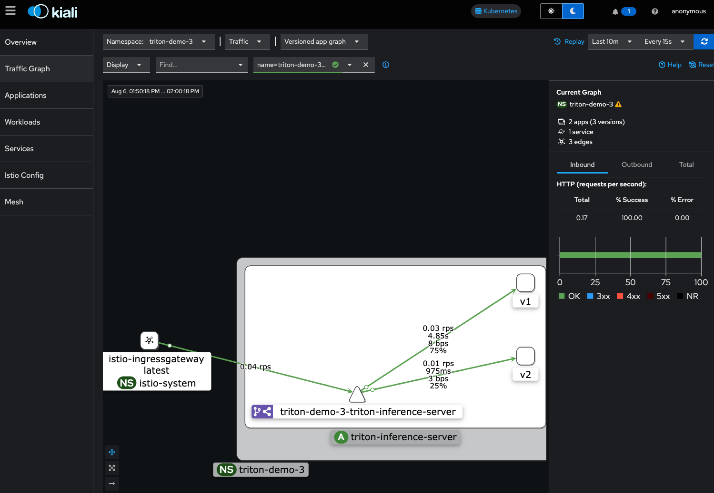

# Демонстрация работы инференс платформы

### Скачивание модели
На S3 скачиваем модель `falcon7b` из нашего репозитория:

```bash
apt install rclone -y
mkdir model_repository
cp -r demo-inferp/falcon7b/model_repository model_repository
```

С помощью утилиты [rclone](https://docs.selectel.ru/cloud/object-storage/tools/rclone/) готовим конфиг следующего содержания:

```
[selectel]
provider = other
env_auth = false
access_key_id =
secret_access_key =
region = ru-1
endpoint = s3.ru-1.storage.selcloud.ru
```

Склонируем себе локально модель и загрузим её в бакет S3:

```bash
rclone copy model_repository/ selectel:<bucket_name>/model_repository
```

Также на SFS создаем папку для хранения кеша модели:

```bash
sudo mkdir -p /mnt/nfs && sudo mount -vt nfs "<sfs ip>:<sfs mount path>" /mnt/nfs
mkdir -p /mnt/nfs/hf_cache
```

Наша инфраструктура готова.

## Базовый сценарий
Суть сценария в базовом деплое несложной модели в эндпоинты

Создаем неймспейс и энейблим istio-injection:
```bash
kubectl create namespace triton-demo-1
kubectl label namespace triton-demo-1 istio-injection=enabled
```

Используем `values` для сценария `demo/base_scenario.yaml`, предварительно скорректировав креды S3:

```yaml
tags:
  autoscaling: false
  traefikBalancing: false
  istioGateway: true
  canary: false
  sfs: false
  s3: true
  istioBasicAuth:
    main:
      enable: true
      passwordBase64: # Добавьте base64-кодированный пароль

main:
  imageName: # Укажите имя образа, например, repo.mlops.selcloud.ru/mldp/triton_transformer_server:24.05-zstd
  numGpus: 1
  environment:
    TRITON_AWS_MOUNT_DIRECTORY: # Укажите путь к директории монтирования AWS, например, /opt/tritonserver

  serverArgs:
    - '--model-repository=s3://# Укажите URL репозитория модели, например, https://s3.ru-1.storage.selcloud.ru:443/<bucket_name>/model_repository'
    - '--log-verbose=1'
  nodeSelector:
    demo: "base"

secret:
  s3:
    region: # Укажите регион, например, ru-1
    id: # Укажите ID
    key: # Укажите ключ
```

Добавим чарты из нашего харбор:
```bash
helm repo add mldp https://repo.mlops.selectel.ru/chartrepo/mldp
```

И установим чарт:
```bash
helm upgrade --install -f base_scenario.yaml --namespace triton-demo-1 triton-demo-1 mldp/triton-inference-server 
```

Зайдем в графана, посмотрим на дашборд. Подадим запрос на выполнение инференса:

```bash
export INFERENCE_URL=<взять из grafana>
curl -X POST $INFERENCE_URL -d '{"inputs": [{"name":"text_input","datatype":"BYTES","shape":[1],"data":["I am going"]}]}'
```

В дашборде должно быть примерно такое:


## Сценарий с автоскейлингом
Суть сценария в автоматическом скейлинге инфраструктуры под трафик

Создаем неймспейс и энейблим istio-injection:
```bash
kubectl create namespace triton-demo-2
kubectl label namespace triton-demo-2 istio-injection=enabled
```

Используем `values` для сценария `demo/autoscaling_scenario.yaml`, предварительно скорректировав креды S3:

```yaml
tags:
  autoscaling: true
  traefikBalancing: false
  istioGateway: true
  canary: false
  sfs: true
  s3: true
  istioBasicAuth:
    main:
      enable: false
      
main:
  imageName: # Укажите имя образа, например, repo.mlops.selcloud.ru/mldp/triton_transformer_server:24.05-zstd
  sfsAddress: # Укажите адрес SFS
  sfsModelDirectoryPath: # Укажите путь к директории модели SFS
  modelRepositoryTritonDirectory: # Укажите путь к директории репозитория модели Triton
  numGpus: 1
  environment:
    TRANSFORMERS_CACHE: # Укажите путь к кэшу трансформеров
    TRITON_AWS_MOUNT_DIRECTORY: # Укажите путь к директории монтирования AWS
  serverArgs:
    - '--model-repository=s3://# Укажите URL репозитория модели'
    - '--log-verbose=1'
  autoscaling:
    minReplicas: 1
    maxReplicas: 2
    metrics:
    - type: Pods
      pods:
        metric:
          name: avg_time_queue_us
        target:
          type: AverageValue
          averageValue: 1000000000m
  nodeSelector:
    demo: "autoscaling"

secret:
  s3:
    region: # Укажите регион, например, ru-1
    id: # Укажите ID
    key: # Укажите ключ

prometheus-adapter:
  namespaceOverride: inferp-platform
  prometheus:
    url: http://kube-prometheus-stack-prometheus
    port: 9090
  rules:
    custom:
      - seriesQuery: 'nv_inference_queue_duration_us{namespace!="",pod!=""}'
        resources:
          overrides:
            namespace:
              resource: "namespace"
            pod:
              resource: "pod"
        name:
          matches: "nv_inference_queue_duration_us"
          as: "time_queue_ms_for_minute"
        metricsQuery: rate(nv_inference_queue_duration_us{<<.LabelMatchers>>}[1m]) / 1000
        # Описание: Эта метрика вычисляет среднее время ожидания в очереди за минуту в миллисекундах.
        # Использование: Используйте эту метрику для мониторинга задержек в очереди и оптимизации производительности.

      - seriesQuery: 'nv_inference_queue_duration_us{namespace!="",pod!=""}'
        resources:
          overrides:
            namespace:
              resource: "namespace"
            pod:
              resource: "pod"
        name:
          matches: "nv_inference_queue_duration_us"
          as: "avg_time_queue_us"
        metricsQuery: 'avg(rate(nv_inference_queue_duration_us{<<.LabelMatchers>>}[30s])/(1+rate(nv_inference_request_success{<<.LabelMatchers>>}[30s]))) by (<<.GroupBy>>)'
        # Описание: Эта метрика вычисляет среднее время ожидания в очереди за 30 секунд в микросекундах.
        # Использование: Используйте эту метрику для детального анализа производительности и выявления узких мест в обработке запросов.

istio:
  accessLogs:
    enable: false
    namespace: istio-system
```

Установим чарт:
```bash
helm upgrade --install -f autoscaling_scenario.yaml --namespace triton-demo-2 triton-demo-2 mldp/triton-inference-server 
```

Далее подаем нагрузку с помощью `perf_client`:
```bash
# Скачаем контейнер с perf_client
docker run -it nvcr.io/nvidia/tritonserver:24.06-py3-sdk
# Создадим данные для нашей модели

cat << EOF > data.json
{
  "data": [
    {
      "text_input": {
        "content": [
          "How can you be"
        ],
        "datatype": "BYTES",
        "shape": [
          1
        ]
      }
    }
  ]
}
EOF

# Внутри контейнера запускаем тест
perf_client -u 176.114.65.99/triton-demo-2/triton-inference-server -m falcon7b --input-data data.json -v --output-tensor-format=json --input-tensor-format=json --concurrency-range 10  -p 200000 --request-period 100
```

Убеждаемся, что HPA поднимает новую реплику, а также что в графане уменьшилась задержка.

## Сценарий с обновлением модели через стратегию Canary
Суть сценария в обновлении модели без downtime и с тестированием трафика на ней (canary deploy)

Создаем неймспейс и энейблим istio-injection:
```bash
kubectl create namespace triton-demo-3
kubectl label namespace triton-demo-3 istio-injection=enabled
```

Используем `values` для сценария `demo/canary_scenario.yaml`, предварительно скорректировав креды S3:

```yaml
tags:
  autoscaling: false
  traefikBalancing: false
  istioGateway: true
  canary: true
  sfs: true
  s3: true
  istioBasicAuth:
    main:
      enable: false
    canary:
      enable: false

main:
  imageName: # Укажите имя образа, например, repo.mlops.selcloud.ru/mldp/triton_transformer_server:24.05-zstd
  sfsAddress: # Укажите адрес SFS, например, 10.222.2.252
  sfsModelDirectoryPath: # Укажите путь к директории модели SFS
  modelRepositoryTritonDirectory: # Укажите путь к директории репозитория модели Triton
  numGpus: 1
  environment:
    TRANSFORMERS_CACHE: # Укажите путь к кэшу трансформеров
    TRITON_AWS_MOUNT_DIRECTORY: # Укажите путь к директории монтирования AWS
  serverArgs:
    - '--model-repository=s3://# Укажите URL репозитория модели'
    - '--log-verbose=1'
  nodeSelector:
    demo: "canary"

canary:
  imageName: # Укажите имя образа, например, repo.mlops.selcloud.ru/mldp/triton_transformer_server:24.05-zstd
  sfsAddress: # Укажите адрес SFS, например, 10.222.2.252
  sfsModelDirectoryPath: # Укажите путь к директории модели SFS
  modelRepositoryTritonDirectory: # Укажите путь к директории репозитория модели Triton
  numGpus: 1
  shmsize: "1024Mi"
  environment:
    TRANSFORMERS_CACHE: # Укажите путь к кэшу трансформеров
    TRITON_AWS_MOUNT_DIRECTORY: # Укажите путь к директории монтирования AWS
  serverArgs:
    - '--model-repository=s3://# Укажите URL репозитория модели' 
    - '--log-verbose=1'
  nodeSelector:
    demo: "canary"

secret:
  s3:
    region: # Укажите регион, например, ru-1
    id: # Укажите ID
    key: # Укажите ключ

istio:
  accessLogs:
    enable: false
    namespace: istio-system
  virtualservice:
    primaryWeight: 80
    canaryWeight: 20
```

Установим чарт:
```bash
helm upgrade --install -f canary_scenario.yaml --namespace triton-demo-3 triton-demo-3 mldp/triton-inference-server 
```

Делаем port forward kiali и открываем traffic graph с выставленными из [этой инструкции](https://confluence.selectel.org/pages/viewpage.action?pageId=286067687) параметрами.

Запустим потоковый трафик, чтобы увидеть разницу в процентном соотношении трафика:
```bash
export INFERENCE_URL=<взять из grafana>
for i in {1..10000}; do curl -X POST $INFERENCE_URL -d '{"inputs": [{"name":"text_input","datatype":"BYTES","shape":[1],"data":["I am going"]}]}'; done
```

