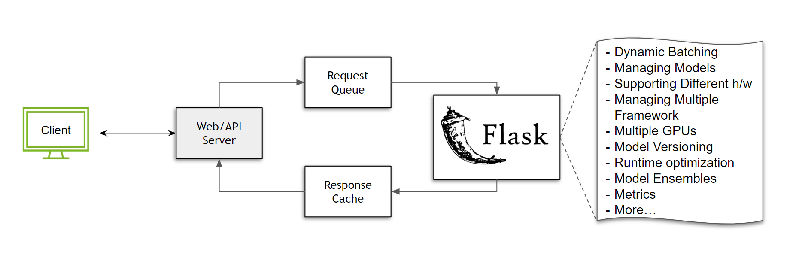

# Миграция на triton inference server

Миграция на новый стек инференса может показаться сложной задачей. Однако, разбив процесс на этапы и следуя лучшим практикам, можно значительно упростить переход. В этом руководстве рассматриваются преимущества использования специализированного сервера инференса, такого как Triton Inference Server, и предлагаются пути его внедрения.

## Зачем нужен специализированный сервер инференса?

Построение инфраструктуры для обслуживания инференса может быть довольно сложным. Рассмотрим простой случай без масштабирования, где используется один узел без балансировщиков нагрузки. Что необходимо для обслуживания модели?

Если вы работаете с Python и новичок в области инференса моделей или хотите быстро что-то построить, вы можете обратиться к инструменту, такому как Flask — универсальному микро-фреймворку, предоставляющему свободу в построении экосистемы по мере необходимости. Для обслуживания чего-либо во Flask достаточно функции, обрабатывающей входящие POST-запросы:

```python
@app.route('/run_my_model', methods=['POST'])
def predict():
    data = request.get_json(force=True)
    # Предобработка
    ...
    prediction = model(<data>)
    # Постобработка
    ...
    return output
```

Всего несколькими строками кода мы запускаем нашу модель. Любой может отправить запрос и использовать модель! Но что произойдет, когда мы начнем получать несколько запросов? Нам потребуется организовать очередь. Допустим, мы используем Celery для решения этой задачи. Пока мы этим занимаемся, можем также построить кэш ответов для обработки повторяющихся запросов.



Хотя такая настройка работает, она ограничена и неэффективна с точки зрения ресурсов. Почему? Предположим, мы работаем с моделью классификации изображений с максимальным размером пакета 64, и наш сервер получает 50 запросов каждые 100 мс. Без реализации какой-либо стратегии пакетирования все эти запросы будут обрабатываться последовательно, что приводит к неэффективному использованию ресурсов GPU.

Это лишь верхушка айсберга. Рассмотрим следующие случаи:

- Что если мы хотим поддерживать несколько моделей?
- Нужно ли перезапускать сервер каждый раз при обновлении модели?
- Как версионировать модель?
- Можем ли мы обслуживать модели PyTorch и TensorFlow на одном сервере?
- Что если одна модель должна работать на CPU, а другая на GPU?
- Как оптимизировать выполнение?
- Как управлять несколькими GPU на одном узле?
- Оптимизировано ли наше время выполнения?
- Эффективно ли мы обрабатываем ввод-вывод?
- Как работать с ансамблем моделей?
- Как лучше всего мониторить метрики сервера?

Это лишь некоторые из вопросов, которые необходимо учитывать, вкладывая инженерные ресурсы в построение и поддержку инфраструктуры. Кроме того, эти функции придется регулярно поддерживать и оптимизировать для каждой новой версии программного обеспечения и аппаратных ускорителей или контекста выполнения. Эти проблемы только усугубляются по мере масштабирования развертывания.

Очевидно, что решение не может заключаться в том, чтобы каждый разработчик начинал с многоцелевого фреймворка и тратил ресурсы на построение и поддержку инфраструктуры. Здесь на помощь приходит специализированный сервер инференса, такой как Triton Inference Server, который решает множество проблем.

## Как мигрировать мой код на Triton?

Это руководство предполагает понимание основ Triton Inference Server на концептуальном уровне. Если вы новичок в Triton Inference Server, рекомендуется ознакомиться с [видео для начала работы](https://www.youtube.com/watch?v=NQDtfSi5QF4) и [этим руководством](https://github.com/triton-inference-server/tutorials/blob/main/Conceptual_Guide/Part_1-model_deployment/README.md).

Каждый существующий конвейер инференса уникален, поэтому не существует универсального решения для миграции вашего текущего стека на Triton Inference Server. Тем не менее, это руководство поможет построить интуитивное понимание процесса миграции.

В общем и целом, большинство стеков инференса можно разделить на четыре категории:

1. **Тесно связанный с большим модулем**: Возможно, вы находитесь в процессе итерации или тонкой настройки модели, где отделение модели от существующего стека потребует значительных усилий. Вам все еще нужна лучшая производительность для минимизации использования аппаратных ресурсов и возможность делиться вашей разработкой с внутренними командами. Усилия, необходимые для изоляции зависимостей, экспорта моделей, настройки хранилища и т. д., нецелесообразны. В этом случае рекомендуется использовать [PyTriton](https://github.com/triton-inference-server/pytriton), который предоставляет интерфейс, похожий на Flask/FastAPI, позволяющий использовать Triton Inference Server для вашего случая.

   Пример использования PyTriton:

   ```python
   from pytriton.decorators import sample
   from pytriton.model_config import ModelConfig, Tensor
   from pytriton.triton import Triton

   MODEL = ...

   @sample
   def your_function_name(sequence: np.ndarray, labels: np.ndarray):
       # Декодирование входных данных
       sequence = np.char.decode(sequence.astype("bytes"), "utf-8")
       labels = np.char.decode(labels.astype("bytes"), "utf-8")
       result = MODEL(...)
       return {"scores": results}

   # PyTriton code
    with Triton() as triton:
        triton.bind(
            model_name="<model name>",
            infer_func=<your_function_name>,      # function you want to serve
            inputs=[
                Tensor(name="sequence", dtype=bytes, shape=(1,)),
                Tensor(name="labels", dtype=bytes, shape=(-1,)),
            ],
            outputs=[
                Tensor(name="scores", dtype=np.float32, shape=(-1,)),
            ],
            # add the features you want to enable here
            config=ModelConfig(batching=False),
        )
       triton.serve()
   ```

 Ключевой момент заключается в том, что любая функция, которую вы хотите обслуживать, будь то компонент инференса модели или просто некоторый код на Python, может быть связана с Triton. Как пользователь, вам не нужно беспокоиться о запуске Triton Inference Server или создании репозитория моделей — все необходимые шаги обрабатываются библиотекой PyTriton. Более подробную информацию об архитектуре можно найти здесь.

2. **Слабо связанный, но запутанный конвейер:** Предположим, что конвейер, который вы обслуживаете, может быть изолирован в другую среду. Пользователи обычно находятся на этом этапе, когда модели и конвейеры проходят внутреннее тестирование и дают удовлетворительные результаты. Тем не менее, они всё ещё могут работать с запутанными конвейерами, где некоторые модели не могут быть экспортированы, а этапы пред- и постобработки всё ещё тесно связаны с логикой конвейера.

    В этом случае пользователи всё ещё могут использовать PyTriton, но если некоторые модели можно экспортировать, они могут получить более высокую производительность, используя Python-бэкенд Triton вместе с другими фреймворк-бэкендами. Часть 6 концептуального руководства является отличным примером для этого случая.

    В настоящее время не все функции Triton Inference Server могут быть использованы с помощью PyTriton. Пользователи также могут выбрать использование Python-бэкенда, чтобы воспользоваться полным набором функций, которые предлагает Triton Inference Server. Как пример - HuggingFace.

3. **Слабо связанный, модульный конвейер:** С увеличением сложности конвейеров часто возникает ситуация, когда в глубоком обучении есть значительные пересечения, то есть несколько конвейеров используют общий набор моделей или этапов пред- и постобработки. В этих случаях крайне полезно развернуть все компоненты конвейеров на Triton Inference Server, а затем построить ансамбли моделей. Даже в случае, когда пересечений нет, использование ансамблей моделей Triton для управления конвейерами обеспечивает преимущества в масштабировании и производительности. Для подробного объяснения обратитесь к этому руководству.

4. **Развертывание отдельных моделей без пред- и постобработки:** Во многих случаях логика конвейера существует в виде чрезвычайно оптимизированных низкоуровневых скриптов, разработанных за годы работы. В этом случае пользователи могут предпочесть развернуть только модели и избежать сетевых вызовов HTTP/gRPC, поскольку модель используется более крупными приложениями. Для этого модели могут быть доступны с использованием расширений общей памяти Triton и C API, что устраняет необходимость в сетевом интерфейсе.

## Заключение

Хотя существует множество способов развертывания моделей, каждый случай представляет свои собственные задачи и требования. Эти требования могут быть удовлетворены с помощью различных функций Triton Inference Server. Мы рекомендуем вам изучить документацию Triton Inference Server, чтобы найти более подробную информацию о функциях!